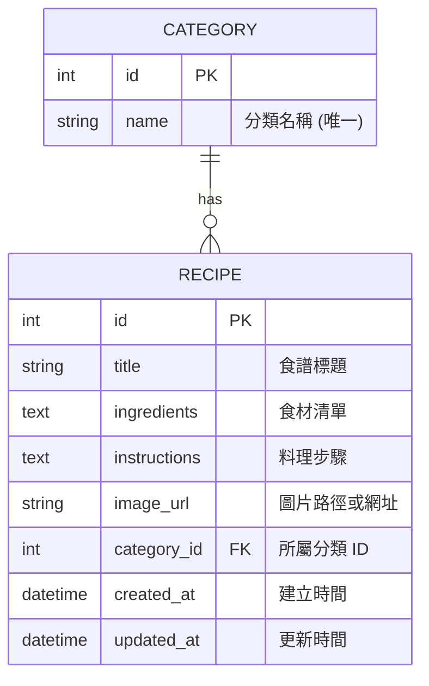

# 資料庫設計文件 (DB Design)

這份文件說明「食譜收藏夾系統」的資料庫結構，包含實體關係圖 (ER 圖)、資料表詳細說明。

## 1. ER 圖 (實體關係圖)

## 2. 資料表詳細說明

### 2.1 CATEGORY (分類表)
負責儲存食譜的分類，例如：中式、甜點、晚餐等。

| 欄位名稱 | 型別 | 必填 | 說明 |
| :--- | :--- | :--- | :--- |
| `id` | INTEGER | 是 | Primary Key, 自動遞增 |
| `name` | VARCHAR(50) | 是 | 分類名稱，必須是唯一值 (Unique) |

### 2.2 RECIPE (食譜表)
負責儲存食譜的主要內容。

| 欄位名稱 | 型別 | 必填 | 說明 |
| :--- | :--- | :--- | :--- |
| `id` | INTEGER | 是 | Primary Key, 自動遞增 |
| `title` | VARCHAR(200) | 是 | 食譜標題 |
| `ingredients` | TEXT | 是 | 食材清單 (純文字) |
| `instructions` | TEXT | 是 | 料理步驟 (純文字) |
| `image_url` | VARCHAR(500) | 否 | 上傳的圖片路徑或匯入的外部網址 |
| `category_id` | INTEGER | 否 | Foreign Key, 對應到 `categories.id` |
| `created_at` | DATETIME | 是 | 記錄建立時間 (預設為當下時間) |
| `updated_at` | DATETIME | 是 | 記錄最後更新時間 (預設為當下時間) |
