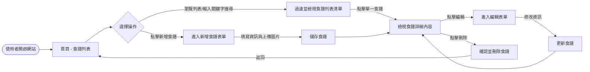
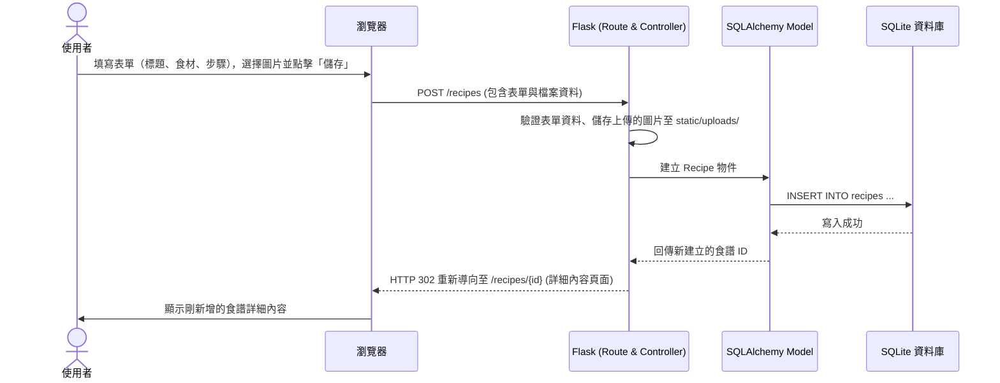

# 流程圖文件 (Flowcharts)

本文件根據產品需求文件 (PRD) 與系統架構文件 (ARCHITECTURE)，以視覺化的方式展示「食譜收藏夾系統」的使用者操作路徑與系統資料流向。

## 1. 使用者流程圖（User Flow）

此流程圖描述使用者進入網站後，可以進行的所有主要操作路徑（如：瀏覽、搜尋、新增、編輯、刪除食譜）。

## 2. 系統序列圖（Sequence Diagram）

此序列圖描述一個完整的資料寫入流程，以「使用者點擊新增食譜並送出表單」為例，展示各個系統元件之間如何溝通與傳遞資料。

## 3. 功能清單對照表

以下表格將 PRD 中規劃的功能，對應到未來要實作的 URL 路徑與 HTTP 方法。

| 功能名稱 | 功能描述 | 建議 URL 路徑 | HTTP 方法 |
| :--- | :--- | :--- | :--- |
| **食譜列表與搜尋** | 顯示所有儲存的食譜清單；支援傳遞搜尋關鍵字 (`?q=...`) 進行過濾 | `/` 或 `/recipes` | `GET` |
| **檢視食譜詳細內容** | 顯示單一食譜的完整資訊（包含圖片、食材、步驟、標籤） | `/recipes/<id>` | `GET` |
| **新增食譜 (頁面)** | 顯示供使用者填寫的新增食譜表單 | `/recipes/new` | `GET` |
| **新增食譜 (處理)** | 接收並驗證表單資料，儲存圖片與寫入資料庫，完成後導向詳細頁面 | `/recipes` | `POST` |
| **編輯食譜 (頁面)** | 顯示原有食譜資料的編輯表單，讓使用者進行修改 | `/recipes/<id>/edit` | `GET` |
| **更新食譜 (處理)** | 接收更新後的表單資料並儲存至資料庫，完成後導向詳細頁面 | `/recipes/<id>/edit` | `POST` |
| **刪除食譜 (處理)** | 從資料庫中刪除指定的食譜與關聯圖片，完成後導向列表頁 | `/recipes/<id>/delete` | `POST` |

> 註：由於不使用前端框架的純 AJAX，在標準 HTML 表單中僅支援 `GET` 與 `POST` 方法，因此更新與刪除操作會使用 `POST` 搭配特定的 URL 設計。
